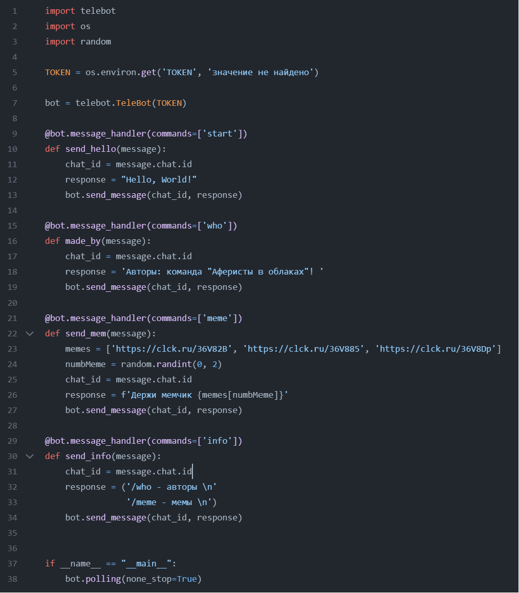
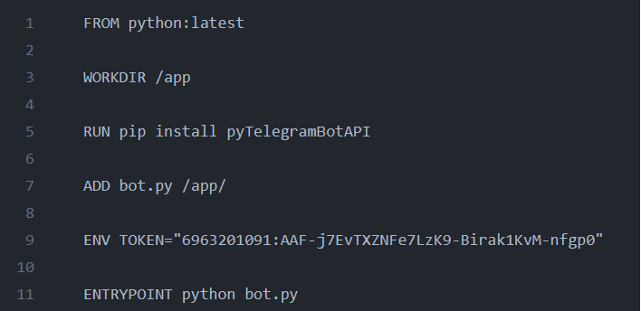

# Лабораторная работа 2
 ТЕСТ ВЕРСИЯ . В РАЗРАБОТКЕ(В НАПИСАНИИ)

### Цель работы
Написать два Dockerfile – плохой и хороший. Описать все плохие практики из кода Dockerfile и почему они плохие, как они были исправлены в хорошем  Dockerfile, а также две плохие практики по использованию этого контейнера

### Telegram bot

За основу в работе с Dockerfile был выбран телграмм-бот.

Телеграм-бот на основе библиотеки Telebot для Python. Бот создается с использованием токена.

### Создание и запуск

Используются для этого две команды:

**docker build -t badbot .** : Эта команда создает Docker-образ, используя текущий каталог (.) в качестве контекста сборки. Флаг -t задает тег для образа, в данном случае он назван "badbot".

**docker run --name badtgbot -e -d badbot**: Эта команда запускает Docker-контейнер на основе образа "badbot". 

А теперь,когда мы знаем, что внутри нашего Dockerfile и какими командами всё это привести в работу, стоит поговорить о самом файле. Плохое и хорошее его исполнение.

### BAD DOCKERFILE

### GOOD DOCKERFILE

### Вывод

В данной работе мы научились включать ssh-серверы, а также копировать файлы и передавать их с помощью утилиты scp. Кроме того, мы успешно выполнили генерацию ssh-ключей и подключение к другому компьютеру по ним.
